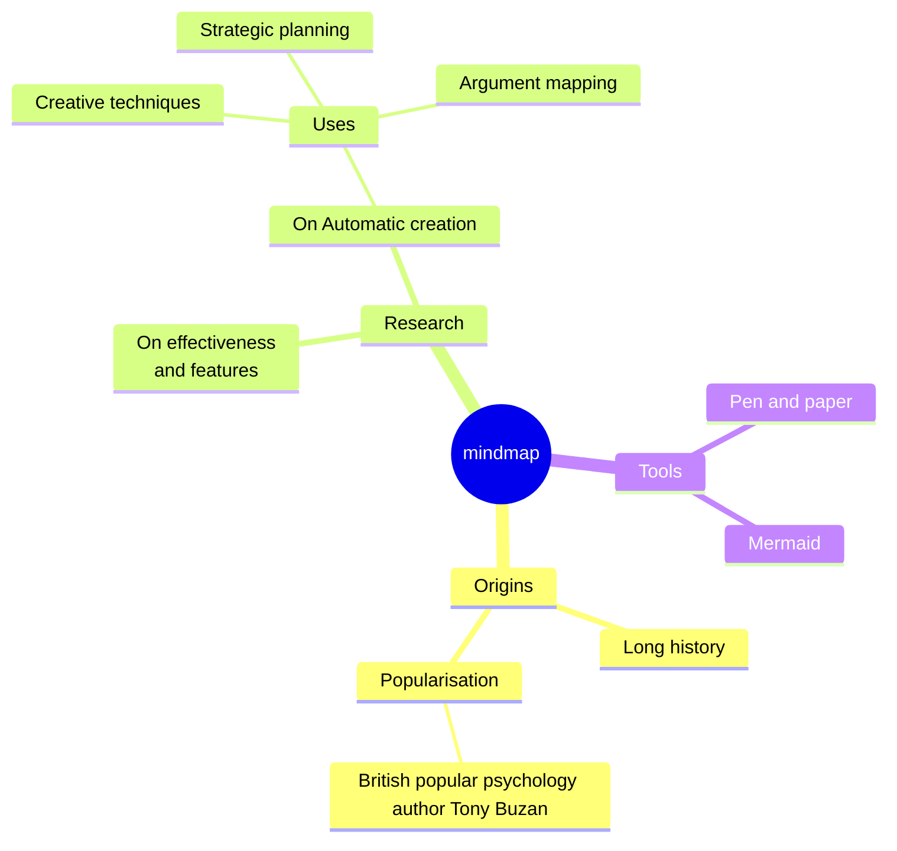
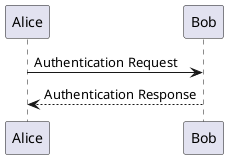

**Geek Editor v2.0** is an open-source, free WYSIWYG Markdown writing and typesetting editor, as well as a note-taking tool based on real-time storage in the GitHub/Gitee/GitLab repository. Currently, the Web App code has been fully open-source: [GeekEditor](https://github.com/geekeditor/geekeditor). The Markdown editor used in it has also been open-source: [MEditable](https://github.com/geekeditor/meditable). Welcome Star!

## 1. Features

#### 1.1 Data is private, not require image bed

It supports real-time storage on local disks and `GitHub/Getee/GatLab` repositories, with images automatically uploaded and saved to the repositories. It is also possible to take rich text notes without configuring an independent image bed. What's more, it supports dragging images to the editor.

Public repositories can be used to store public columns for readers to read; Private repositories can be used to store private notes. If you want to destroy all documents, you can clear them with just one click, allowing for free management, migration, and deletion.

Data is private, storage is free, and long-term storage of content is not disconnected. For highly private content, the editor will support setting password encryption storage.

#### 1.2 Markdown format, WYSIWYG

The document is stored in plain text Markdown syntax format and can be easily migrated to other platforms.

Using WYSIWYG editing method, it supports CommonMark and GFM (GitHub Flavored Markdown) standards, as well as mathematical expressions (KaTeX), charts (Mermaid/Flowchart/Vegas/Plantuml), Frontmeta, Emoji, and other extensions.

The editor adheres to simplicity and efficiency, with only commonly used key function buttons placed on the interface. For long writing, the editor will continue to optimize its interaction.

#### 1.3 Virtual directory, flattened physical storage

The physical storage of documents is flat. The directory structure is presented in a non physical manner, using an index.md document to store the directory structure tree. Markdown documents and image resources are stored in separate physical folders. There are the following physical files and folders in the warehouse:

- index.md: Stores the directory structure of user created documents

- docs：Stores markdown documents

- assets：Store image resources

#### 1.4 Theme layout, custom style

Separate writing and typesetting. After writing, you can customize the layout and export it. The editor has multiple built-in layout themes, and CSS layout themes can also be customized.

#### 1.5 Multi format export, quick distribution

It supports the export of Image, PDF, HTML, Textbundle, Markdown, TXT and other format documents, and supports the synchronization of articles to the official account.

#### 1.6 Backup encryption configuration

Support password encryption configuration backup to local or cloud, facilitating cross device writing.

## 2. Markdown Syntax Guide

#### 2.1 CommonMark

**strong** *emphasis* `inline code` &gt; <u>underline</u> <mark>highlight</mark> <ruby>GeekEditor<rt>ji ke bian ji qi</rt></ruby> [GeekEditor](https://www.geekeditor.com) H0~2~ X^5^


- Bullet list
    - Bullet list


0. Order list
    0. Order list


```javascript
function add(a, b) {
    return a + b;
}
```


<div>HTML block</div>


> Quote block


---

#### 2.2 GFM

:man:  ~~del~~ http://google.com $a + b$


- [x] Todo item

- [ ] Todo item


| Name | Sex | Age |
| ---- | --- | --- |
| Geek | Male | 6 |


#### 2.3 Extension

$$
a + b = c
$$





```flowchart
st=>start: Start:>http://www.google.com[blank]
e=>end:>http://www.google.com
op1=>operation: My Operation
sub1=>subroutine: My Subroutine
cond=>condition: Yes
or No?:>http://www.google.com
io=>inputoutput: catch something...
para=>parallel: parallel tasks

st->op1->cond
cond(yes)->io->e
cond(no)->para
para(path1, bottom)->sub1(right)->op1
para(path2, top)->op1
```

```vega-lite
```

