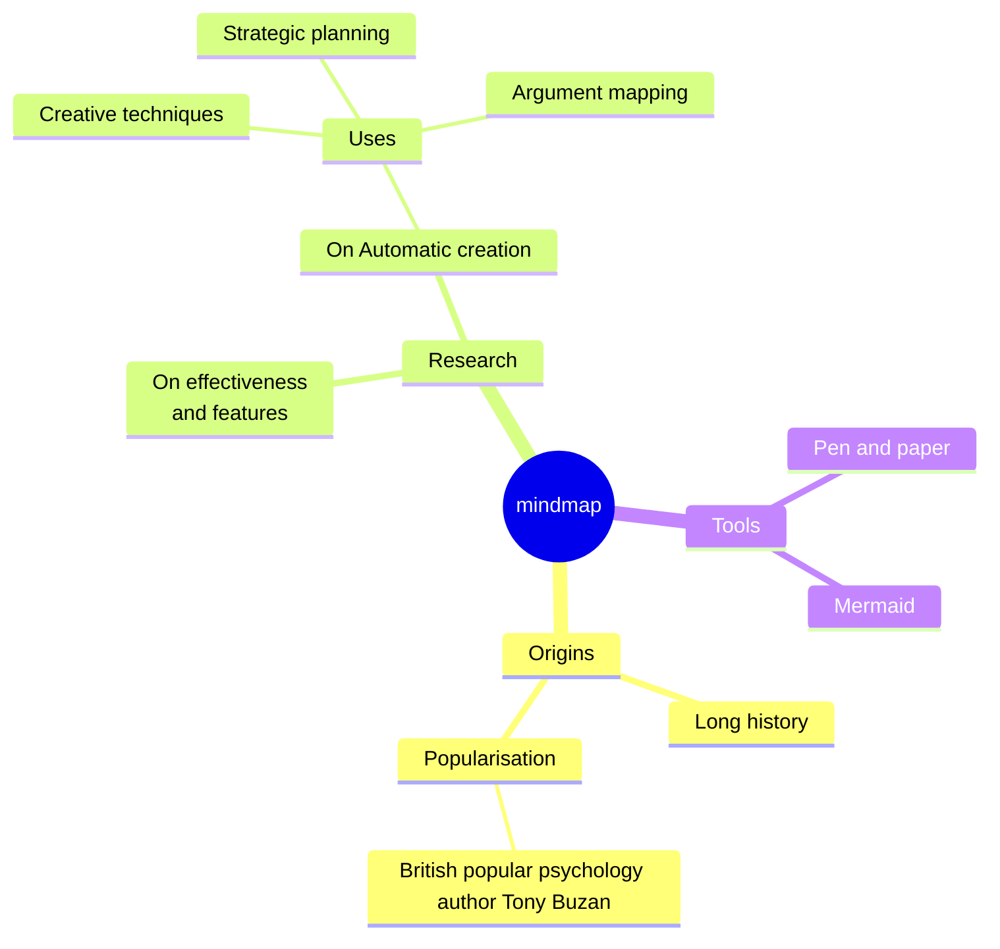
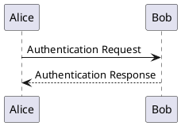

**极客编辑器 v2.0** 是一款开源免费所见即所得 Markdown 写作排版编辑器，同时也是一款基于 GitHub/Gitee/GitLab 仓库实时存储的笔记工具。目前，Web App 代码已全部开源：[GeekEditor](https://github.com/geekeditor/geekeditor)，其中使用的 Markdown 编辑器也已开源：[MEditable](https://github.com/geekeditor/meditable) ，欢迎 Star 哦！

## 1. 特征

#### 1.1 数据私有，无需图床

支持本地磁盘及`GitHub/Gitee/GitLab`仓库实时存储，插入图片自动上传保存到仓库，不配置独立图床也可以无障碍写作。支持拖拽图片到编辑器。

公开仓库，可以用来存储公开专栏，供读者阅读；私有仓库，可以用来存储私密笔记。若要销毁文档，可一键清空，可以非常自由的进行管理、迁移及删除。

数据私有，存储免费，长期存储内容不失联。对于私密性很强的内容，编辑器将支持设置密码加密存储。


#### 1.2 Markdown 格式，所见即所得

文档以纯文本 Markdown 语法格式存储，迁移其它平台快捷无障碍。

Markdown 所见即所得的编辑方式，支持 CommonMark 和 GFM (GitHub Flavored Markdown) 标准，以及数学表达式（KaTeX）、图表（Mermaid / Flowchart / Vega / Plantuml）、Frontmeta、Emoji 等扩展。

编辑器坚持简约高效，界面上仅放置常用关键功能按钮。针对长文写作，编辑器将在交互上持续优化。

#### 1.3 虚拟目录，扁平化物理存储

文档物理存储扁平。目录结构以非物理方式进行呈现，使用 index.md 文档来存储目录结构树。Markdown 文档和图片资源分别存储独立物理文件夹中。在仓库中存在如下物理文件及文件夹：

- index.md：存储用户创建的文档目录结构

- docs：存储 Markdown 文档

- assets：存储图片资源


#### 1.4 主题排版，自定义风格

写作和排版分离。写作完成后，可自定义排版导出。编辑器内置多种排版主题，也可以自定义 CSS 排版主题。

#### 1.5 多格式导出，快捷分发

支持图片、PDF、HTML、Textbundle、Markdown、TXT等格式文档导出，支持同步文章到公众号发布。

#### 1.6 备份加密配置

支持设置密码加密配置备份到本地、云端，方便跨设备写作。

## 2. Markdown 语法指南

#### 2.1 CommonMark

**加粗** *斜体* `行内代码` &gt; <u>下划线</u> <mark>高亮</mark> <ruby>极客编辑器<rt>ji ke bian ji qi</rt></ruby> [极客编辑器](https://www.geekeditor.com) H0~2~ X^5^


- 无序列表
    - 无序列表


0. 有序列表
    0. 有序列表


```javascript
function add(a, b) {
    return a + b;
}
```


<div>HTML块</div>


> 引用块


---

#### 2.2 GFM

:man:  ~~del~~ http://google.com $a + b$


- [x] 待办列表

- [ ] 待办列表


| 姓名 | 性别 | 年龄 |
| ---- | --- | --- |
| 极客 | 男 | 6 |


#### 2.3 其它扩展

$$
a + b = c
$$





```flowchart
st=>start: Start:>http://www.google.com[blank]
e=>end:>http://www.google.com
op1=>operation: My Operation
sub1=>subroutine: My Subroutine
cond=>condition: Yes
or No?:>http://www.google.com
io=>inputoutput: catch something...
para=>parallel: parallel tasks

st->op1->cond
cond(yes)->io->e
cond(no)->para
para(path1, bottom)->sub1(right)->op1
para(path2, top)->op1
```

```vega-lite
```

